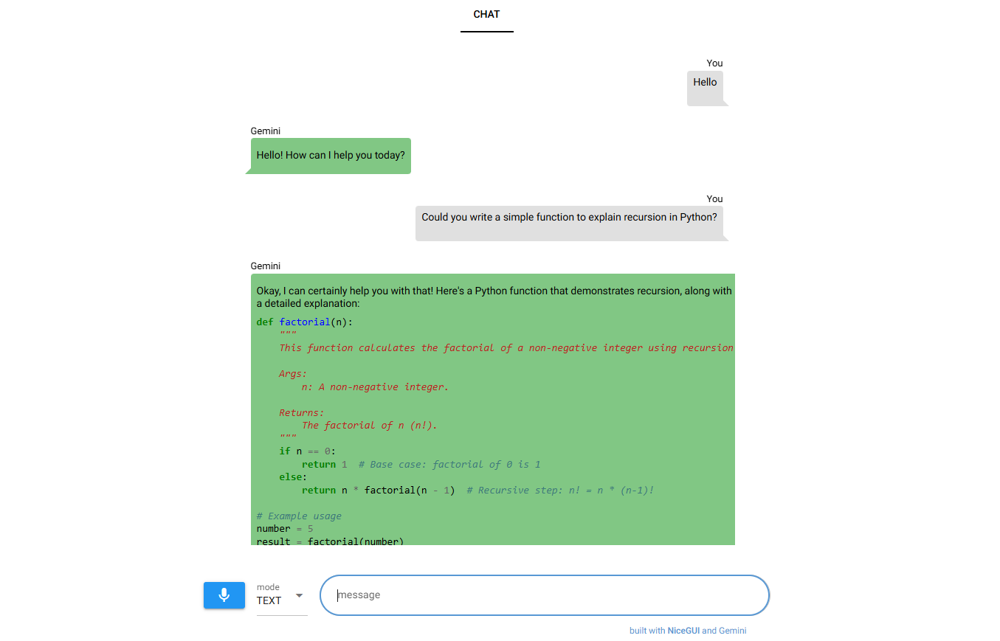

# Gemini Engineer

## Description

Inspired by:
- [claude-engineer](https://github.com/Doriandarko/claude-engineer/tree/main)
- [gemini cookbook](https://github.com/google-gemini/cookbook/tree/main/gemini-2)

An AI assistant built upon the new Gemini 2.0 Flash to allow for real-time audio and text interaction.

Tested on WSL2 Ubuntu 20.04

Important: **use headphones**.

This script uses the system default audio input and output, which often won't include echo cancellation.
So to prevent the model from interrupting itself it is important that you use headphones.

## Web Interface



The `mode` option works as follows:
- `TEXT`: when you press the mic button you can start talking and Gemini will answer by text.
- `AUDIO`: when you press the mic button you can start talking and Gemini will answer by voice. 

## Installation

```bash
sudo apt install libasound2-plugins

# Install uv
curl -LsSf https://astral.sh/uv/install.sh | sh

# Clone and setup
git clone https://github.com/mett29/gemini-engineer.git
cd gemini-engineer
uv sync
source .venv/bin/activate

# Run web interface
python main.py
```

You can also directly run the CLI:

```bash
python src/gemini_engineer.py
```